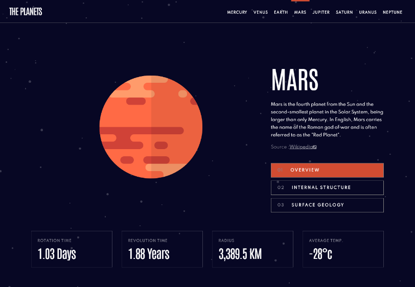
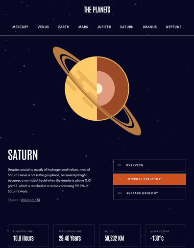
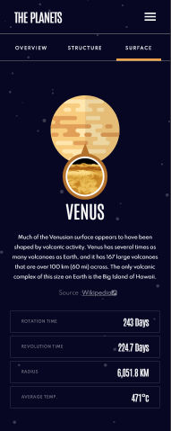

# Frontend Mentor - Planets fact site solution

This is a solution to the [Planets fact site challenge on Frontend Mentor](https://www.frontendmentor.io/challenges/planets-fact-site-gazqN8w_f). Frontend Mentor challenges help you improve your coding skills by building realistic projects. 

### Install all dependencies

```
npm install
```

## Start the project

```
npm start
```

## Table of contents

- [Overview](#overview)
  - [The challenge](#the-challenge)
  - [Screenshot](#screenshot)
  - [Links](#links)
- [My process](#my-process)
  - [Built with](#built-with)
  - [What I learned](#what-i-learned)
  - [Continued development](#continued-development)
  - [Useful resources](#useful-resources)
- [Author](#author)

## Overview

### The challenge

Users should be able to:

- View the optimal layout for the app depending on their device's screen size
- See hover states for all interactive elements on the page
- View each planet page and toggle between "Overview", "Internal Structure", and "Surface Geology"

### Screenshot





### Links

- Code URL: [Code/github](https://github.com/JimAxl1/Planet-fact-app)
- Live Site URL: [Planet_fact_app-FrontendMentor.io](https://planet-fact-app.web.app)

## My process

### Built with

- Semantic HTML5 markup
- CSS
- Flexbox
- CSS Grid
- [React](https://reactjs.org/) - JS library

### What I learned

- Use a local .json and display it's information.
- Apply SOLID principles
- Use css module

### Continued development

I would like to improve my skill with react since the way it helps to create the ui seems comfortable and simple to me, learn more good practices to have a cleaner code and be able to work on team projects

### Useful resources

- [SOLID priciples](https://developero.io/blog/react-solid-example) - This helped me make components easier to maintain and read, and thus take advantage of react and the component format
- [Stack Overflow](https://stackoverflow.com) - It helped me when I was running into compiler errors or css issues.

## Author

- Frontend Mentor - [@JimAxl1](https://www.frontendmentor.io/profile/JimAxl1)
- Github - [@JimAxl1](https://github.com/JimAxl1)